# Early ChildHood Education and Childcare

The project provides an introduction to early child  hood education

Confidential information is not displayed. Please download the executable in for details.

Most of the images are custom.

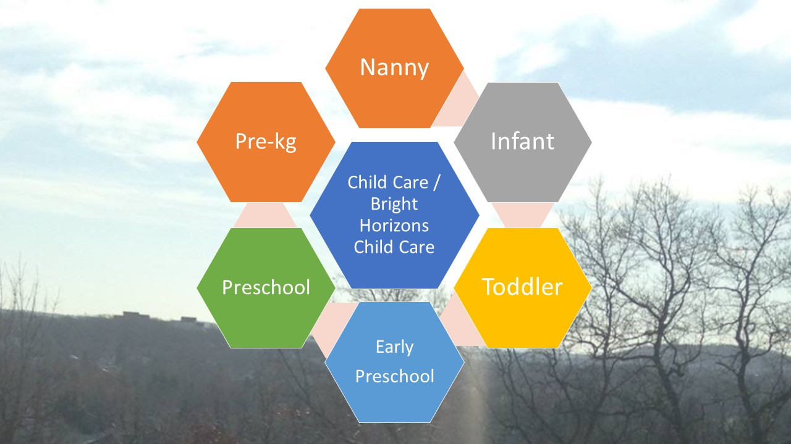

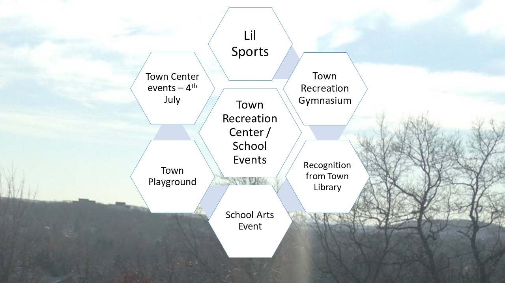

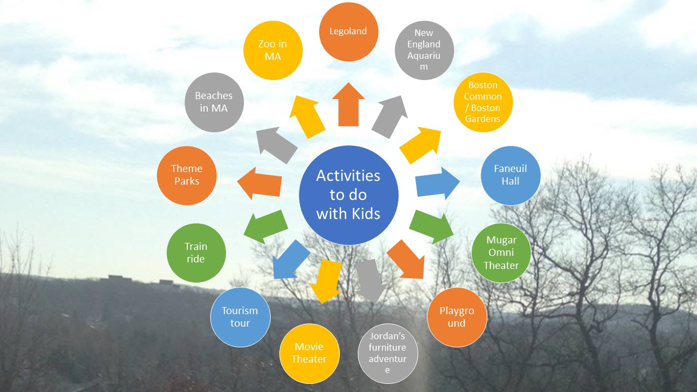

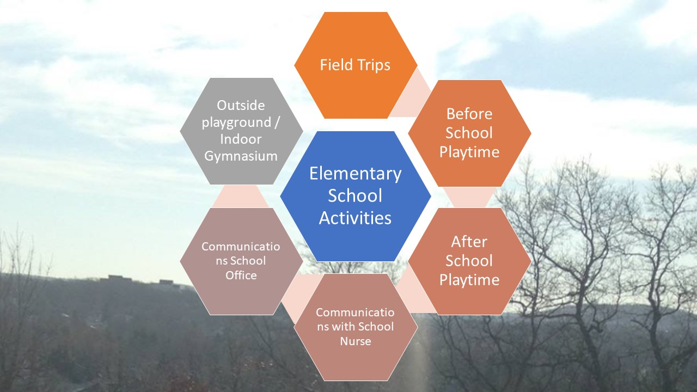

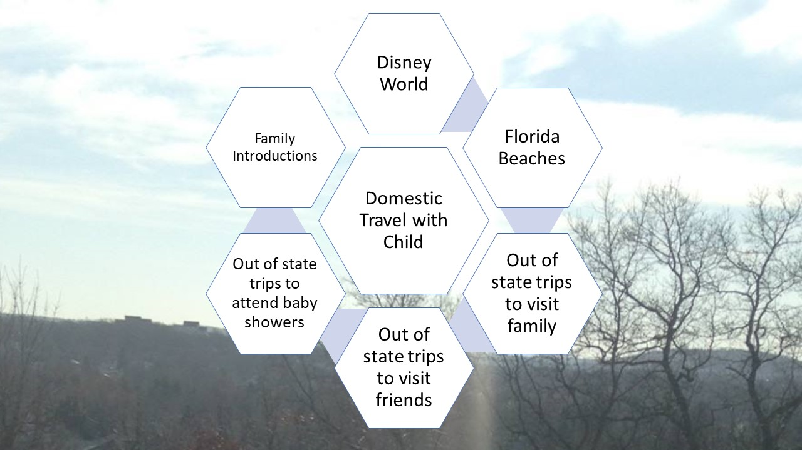

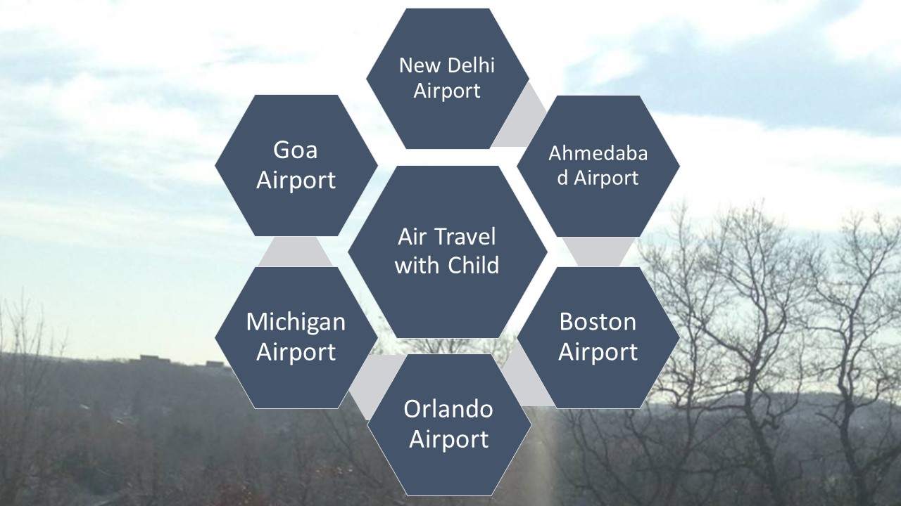

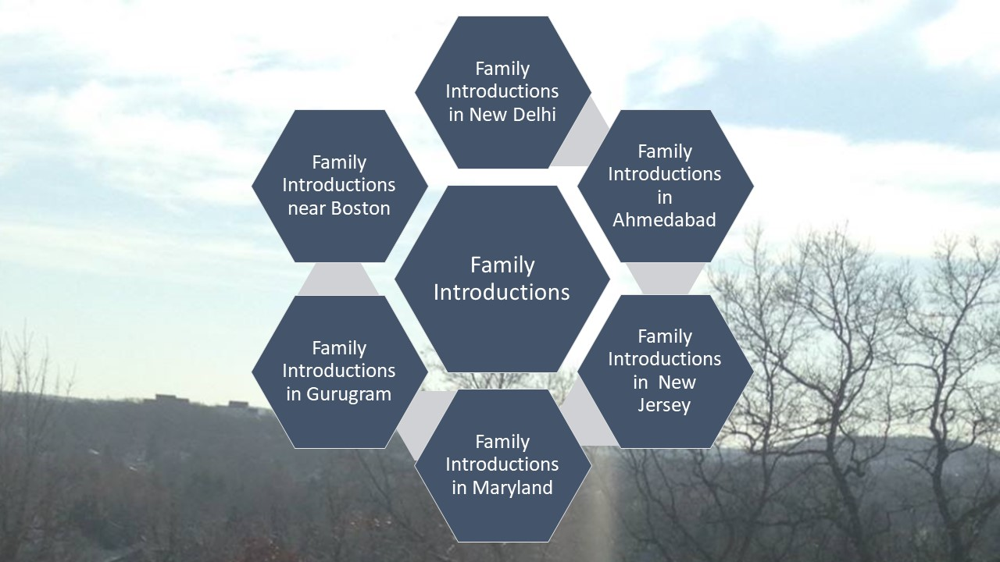

# ChildHood Education 

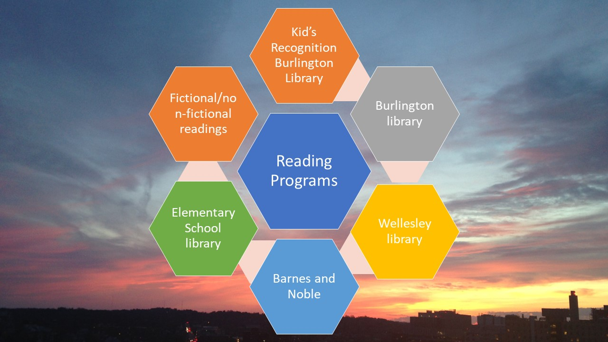

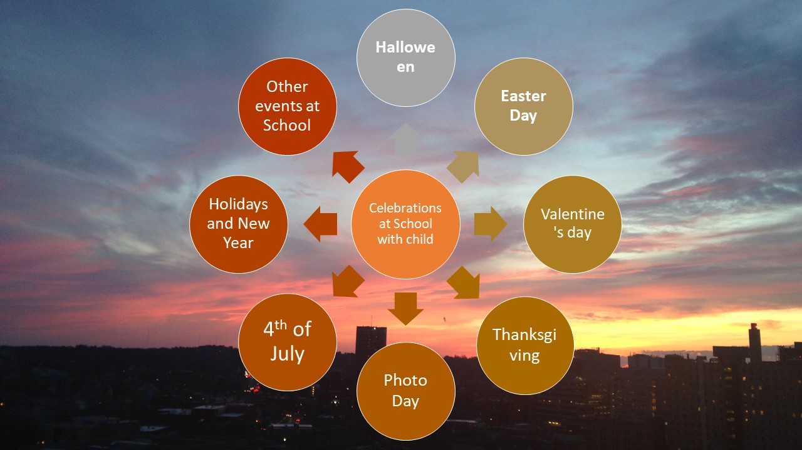

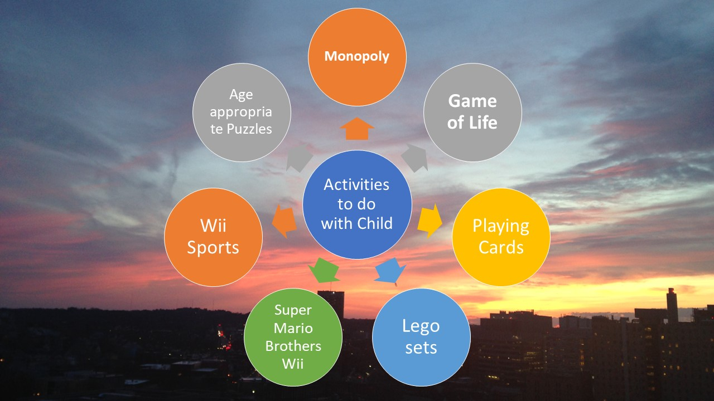

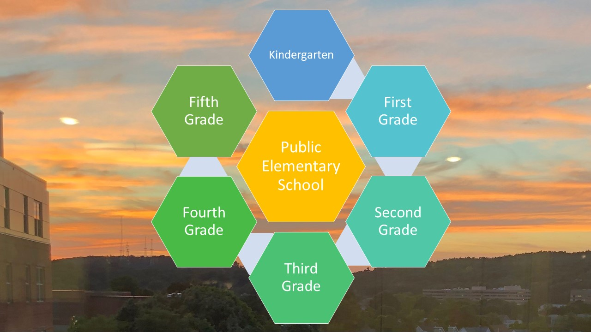

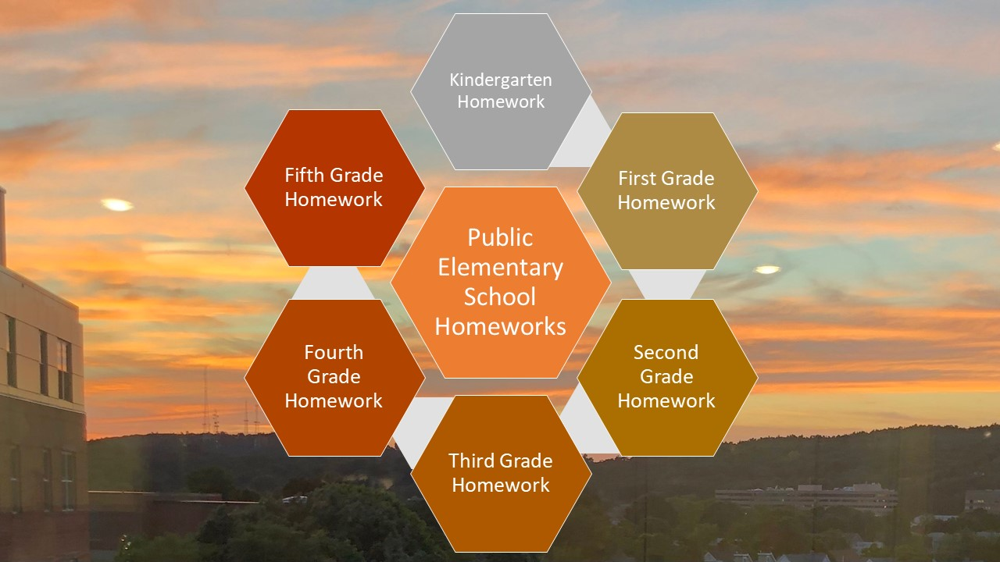

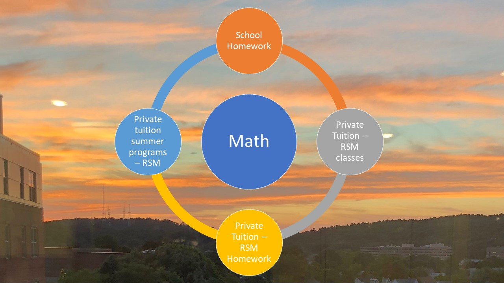

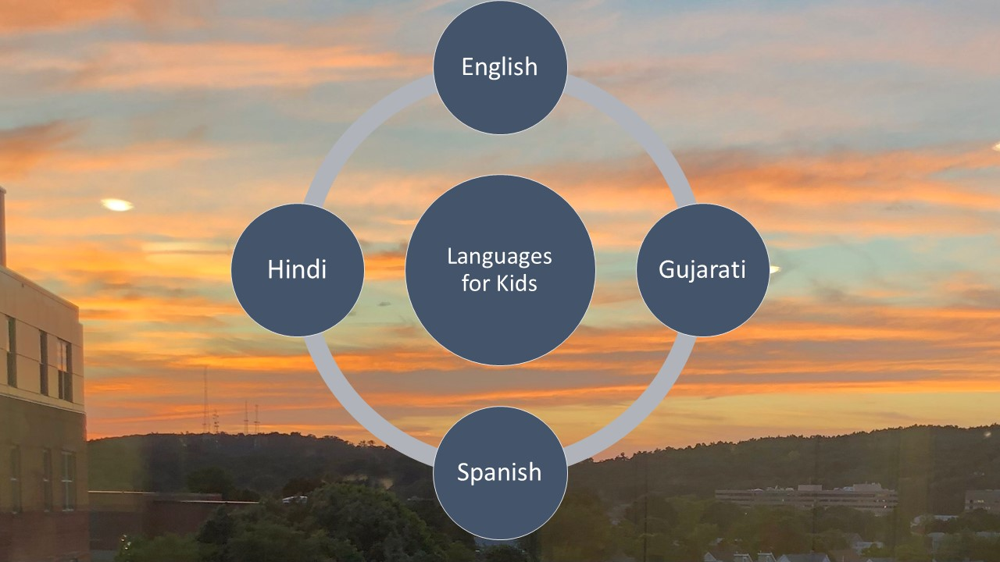

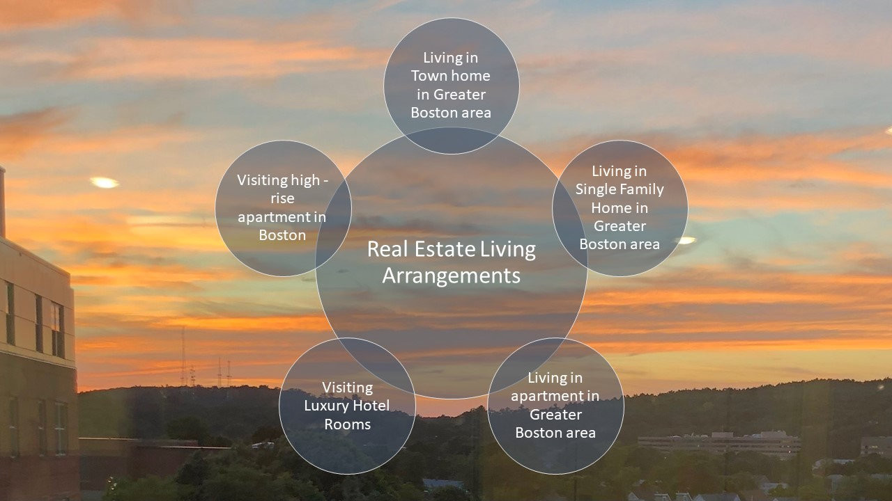

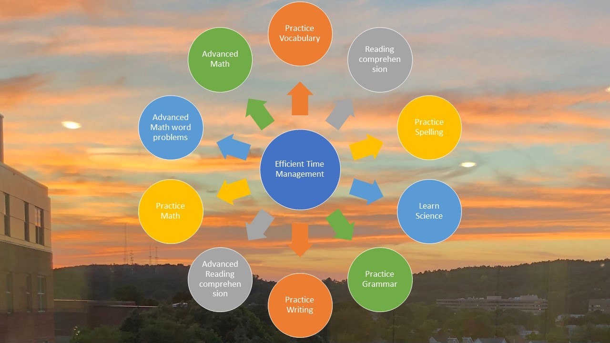

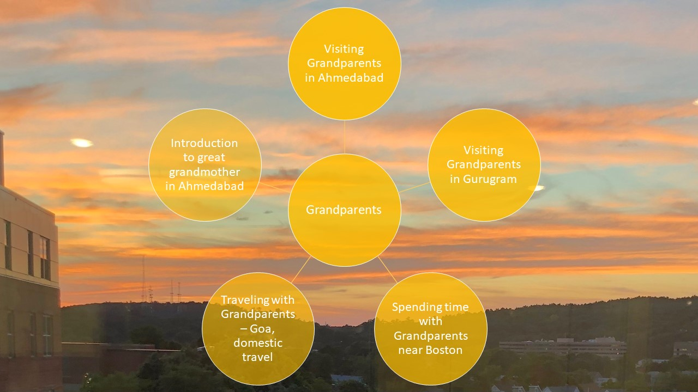

Advanced knowledge reference https://github.com/alpaddesai/RealEstatePortfolioIdea
